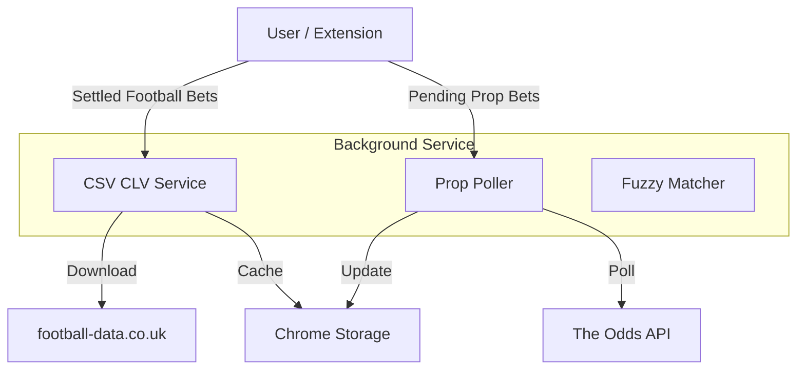

# CLV System Overview

**Version**: 1.0.103+
**Last Updated**: December 11, 2025

## Introduction

The Closing Line Value (CLV) system in Surebet Helper provides a hybrid approach to tracking whether your bets beat the closing line. It combines two distinct methods to cover different types of bets:

1.  **CSV-Based Tracking** for Football Match Odds (1X2, O/U, AH)
2.  **API-Based Polling** for Player Props

This hybrid approach ensures maximum coverage with minimal cost, leveraging free data sources where available and using paid/limited API quotas only where necessary.

---

## 1. Football CLV (CSV-Based)

For major football leagues, we use historical data from [football-data.co.uk](https://www.football-data.co.uk/). This method is **free**, requires **no API keys**, and covers the vast majority of football volume.

### How It Works
1.  **Data Source**: Downloads CSV files containing Pinnacle closing odds.
2.  **Trigger**: Automatically checks settled bets (configurable delay, default 2 hours).
3.  **Matching**: Uses fuzzy matching to link your bet's event name to the CSV rows.
4.  **Markets**: Supports 1X2 (Match Odds), Over/Under 2.5 Goals, and Asian Handicap.
5.  **Caching**: CSV files are cached locally to minimize bandwidth and latency.

### Supported Leagues
Covers 22 major European leagues, including:
*   **England**: Premier League, Championship, League 1/2, National League
*   **Spain**: La Liga, Segunda
*   **Germany**: Bundesliga 1 & 2
*   **Italy**: Serie A & B
*   **France**: Ligue 1 & 2
*   **Others**: Scotland, Netherlands, Belgium, Portugal, Turkey, Greece

### Configuration
*   **Enable/Disable**: Settings → CLV Tracking
*   **Cache**: You can clear the CSV cache in Settings if needed.

---

## 2. Player Props CLV (API-Based)

For player proposition bets (e.g., "LeBron James Over 25.5 Points"), we use **The Odds API**. This method requires a free API key.

### How It Works
1.  **Data Source**: [The Odds API](https://the-odds-api.com/) (requires API key).
2.  **Polling**: Periodically polls for current lines on pending prop bets (8am, 2pm, 8pm).
3.  **Tracking**: Records the line movement from when you placed the bet to the current time.
4.  **Quota Management**: Respects the free tier limits (500 requests/month).

### Supported Sports
*   **Basketball**: NBA, NCAAB (Points, Rebounds, Assists, Threes)
*   **American Football**: NFL, NCAAF (Passing, Rushing, Receiving)
*   **Baseball**: MLB (Strikeouts, Hits, HRs, RBIs)
*   **Hockey**: NHL (Points, Shots, Blocked Shots)

### Configuration
*   **API Key**: Must be entered in Settings → API Setup (`apiOddsKey`).
*   **Polling**: Enabled automatically if API key is present and valid.

---

## System Architecture

## Files & Components

*   **`csvClvService.js`**: Handles CSV downloading, parsing, caching, and CLV calculation for football.
*   **`footballDataLeagues.js`**: Maps Surebet tournament names to CSV league codes.
*   **`prop_poller.js`**: Manages the schedule and API calls for player props.
*   **`fuzzyMatcher.js`**: Provides string similarity functions for matching team names.
*   **`background.js`**: Orchestrates the alarms and integrates these services.

## Troubleshooting

### "CLV: N/A"
*   **Reason**: The bet is not a football match (or not in a supported league) AND not a tracked player prop.
*   **Fix**: Check if the league is covered in the supported list.

### "CLV: Pending"
*   **Reason**: The bet has settled, but the system hasn't run the check yet (default 2-hour delay).
*   **Fix**: You can wait, or use "Force Check Now" in Settings (for football bets).

### "API Key Missing"
*   **Reason**: Player props require an API key.
*   **Fix**: Get a free key from The Odds API and enter it in Settings.

---

**Note**: The Python-based "OddsHarvester" API server (mentioned in older docs) has been deprecated in favor of this lightweight, browser-native hybrid approach.
